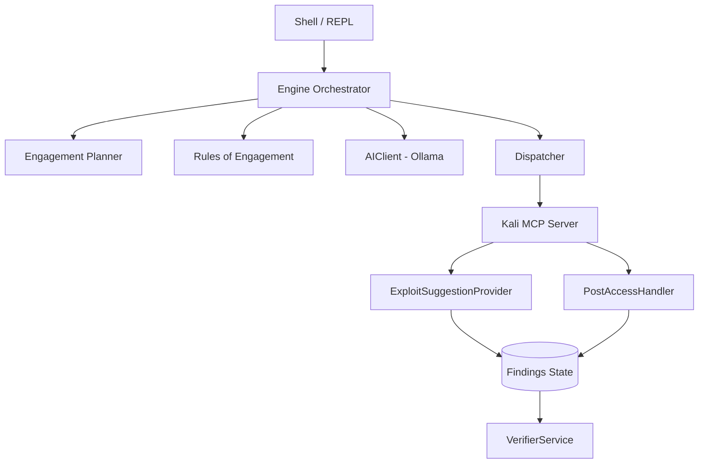

<div align="center">

# 🐍 HydraSight

**AI-orchestrated offensive security assessment framework for authorized lab environments.**

[](https://github.com/Shyamprasanth04/hydrasight/actions/workflows/ci.yml)
[](https://www.python.org/downloads/)
[](https://opensource.org/licenses/MIT)
[](CONTRIBUTING.md)

*A local, interactive CLI framework connecting local LLMs to Kali Linux MCP.*

---

**⚠️ AUTHORIZED TESTING ONLY ⚠️**  
Do not use against systems you do not own or have explicit written permission to test.  
See our [Security Policy](SECURITY.md) and [Contributing Guidelines](CONTRIBUTING.md).

</div>

---

## 📖 Table of Contents
- [What is HydraSight?](#-what-is-hydrasight)
- [Key Features](#-key-features)
- [Architecture Overview](#-architecture-overview)
- [Installation](#-installation)
- [Configuration](#-configuration)
- [Quick Start](#-quick-start)
- [Command Reference](#-command-reference)

---

## 🎯 What is HydraSight?

HydraSight is designed for security practitioners running structured assessments in isolated lab environments. It bridges the gap between AI reasoning and active security tooling.

By connecting a **local LLM** (via [Ollama](https://ollama.com)) to a **[Kali Linux MCP server](https://www.kali.org/blog/kali-linux-model-context-protocol-server/)**, HydraSight orchestrates penetration testing tools through a stateful, safety-gated dispatch layer.

> **Note:** HydraSight is not a general-purpose chatbot, a product, or a cloud service. It is a strictly controlled, local-first operator console.

---

## ✨ Key Features

| Feature | Description |
| :--- | :--- |
| **🧠 Natural Language Interface** | Describe your intent. HydraSight classifies, proposes, confirms, and executes. |
| **🛡️ Strict Mode Separation** | Chat *never* dispatches tools. `/run` and `autopwn` are explicit execution paths. |
| **💾 Stateful REPL** | Maintains findings, timeline, credentials, and sessions across the engagement. |
| **🧭 Adaptive Planner** | Branch-aware planning: recon-only, validation, credential-led, exploit-led, and post-access. |
| **🚦 Rules of Engagement (ROE)**| Scope enforcement via `hydrasight.roe.json` (targets, ports, approval gates, kill switch). |
| **✅ Finding Verification** | Second-pass targeted probes automatically verify CRITICAL/HIGH findings. |
| **📊 Confidence Scoring** | Every finding and suggestion is backed by a `0.0–1.0` confidence score. |
| **🧪 Dry-Run Planning** | `plan` and `suggest` commands reveal full AI intent before packets are sent. |
| **📝 PDF Reporting** | Generates dark-themed PDF reports with verified findings and remediation notes. |

---

## 🏗️ Architecture Overview

HydraSight's architecture ensures that AI cannot blindly fire exploits. Every action passes through deterministic parsing, planning, and policy enforcement layers.



*(See [PROJECT_CONTEXT.md](PROJECT_CONTEXT.md) for an in-depth code architecture breakdown).*

---

## ⚙️ Installation

To set up HydraSight for development or usage:

```bash
# 1. Clone the repository
git clone https://github.com/Shyamprasanth04/hydrasight.git
cd hydrasight

# 2. Install (editable mode with dev tools)
pip install -e ".[dev]"
```

### Prerequisites

| Component | Environment | Action |
| :--- | :--- | :--- |
| **Python 3.10+** | Host Machine | Run `pip install` |
| **[Ollama](https://ollama.com)** | Host Machine | `ollama serve && ollama pull qwen2.5:7b` |
| **[Kali MCP](https://www.kali.org/blog/kali-linux-model-context-protocol-server/)** | Kali VM | `kali-linux-mcp --transport sse` |

---

## 🔧 Configuration

Copy the example configuration to establish your environment settings:

```bash
cp hydrasight.json.example hydrasight.json
```

**Example `hydrasight.json`:**
```json
{
  "ollama_url":    "http://localhost:11434",
  "kali_api_url":  "http://<kali-vm-ip>:<port>",
  "model":         "qwen2.5:7b",
  "execution_mode": "confirm"
}
```

> 💡 **Tip:** You can override any setting using environment variables prefixed with `HYDRA_` (e.g., `HYDRA_MODEL=llama3.1:8b`).

---

## 🚀 Quick Start

Start the REPL environment:

```bash
python -m hydrasight
```

Inside the HydraSight console:
```text
hydrasight › status             # Verify Ollama & Kali connectivity
hydrasight › plan               # View the branch-aware roadmap (dry run)
hydrasight › autopwn 10.0.2.5   # Begin a full, adaptive engagement
```

---

## 💻 Command Reference

<details>
<summary><strong>Click to expand all REPL commands</strong></summary>

### ⚔️ Engagement Actions
*   `autopwn <ip>`: Adaptive full-spectrum assessment
*   `scan <ip>`: Deep port scan only
*   `verify`: Run second-pass verification on current findings
*   `abort`: Abort current engagement

### 🗺️ Planning (No Execution)
*   `plan`: Branch-aware engagement roadmap
*   `suggest`: Ranked access/exploit candidates with confidence
*   `conclusion`: Engagement outcome summary

### 🗣️ Natural Language Interface
*   `<any request>`: Auto-classified — explains, proposes, or confirms before acting.
*   `/ask <question>`: Force chat mode — never executes tools.
*   `/run <action>`: Force tool routing (e.g., `/run check smb on 192.168.1.10`).
*   `yes` / `confirm`: Confirm a proposed action.
*   `no` / `cancel`: Cancel a proposed action.

### 🛡️ Execution Modes
*   `mode confirm`: Always ask before NL-initiated execution (default).
*   `mode auto`: High-confidence requests execute automatically.
*   `mode never`: NL never executes tools — explain/suggest only.

### 🗃️ Data Inspection
*   `findings`, `ports`, `vulns`, `creds`, `hashes`, `sessions`

### 📤 Output & System
*   `save [file]`: Save findings to JSON
*   `report <ip>`: Generate PDF report
*   `status`, `roe`, `config`, `stats`, `verbose 0-3`, `clear`, `help`, `exit`
</details>

---

## 🧪 Testing

HydraSight features a robust offline test suite (393 tests). No Ollama or Kali server is required to run them:

```bash
python -m pytest tests/ -q -p no:ethereum
```

---

<div align="center">
  <b>Built with ❤️ for authorized security research.</b><br>
  Released under the <a href="LICENSE">MIT License</a>.
</div>
