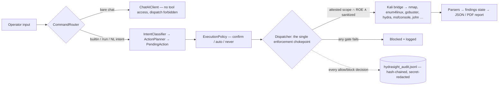

<div align="center">

<pre>
██╗  ██╗██╗   ██╗██████╗ ██████╗  █████╗ ███████╗██╗ ██████╗ ██╗  ██╗████████╗
██║  ██║╚██╗ ██╔╝██╔══██╗██╔══██╗██╔══██╗██╔════╝██║██╔════╝ ██║  ██║╚══██╔══╝
███████║ ╚████╔╝ ██║  ██║██████╔╝███████║███████╗██║██║  ███╗███████║   ██║
██╔══██║  ╚██╔╝  ██║  ██║██╔══██╗██╔══██║╚════██║██║██║   ██║██╔══██║   ██║
██║  ██║   ██║   ██████╔╝██║  ██║██║  ██║███████║██║╚██████╔╝██║  ██║   ██║
╚═╝  ╚═╝   ╚═╝   ╚═════╝ ╚═╝  ╚═╝╚══════╝╚═╝ ╚═════╝ ╚═╝  ╚═╝   ╚═╝
</pre>

**AI-assisted offensive-security orchestration — every action proposed, gated, and provably audited.**

Local LLM (Ollama) + Kali Linux tooling + a fail-closed safety core. Built for authorized labs, CTFs, and engagements with written permission.

[](https://github.com/Shyamprasanth04/hydrasight/releases/tag/v4.1.0)
[](https://pypi.org/project/hydrasight/)
[](https://shyamprasanth04.github.io/hydrasight/)
[](https://github.com/Shyamprasanth04/hydrasight/actions/workflows/ci.yml)
[](https://github.com/Shyamprasanth04/hydrasight/actions/workflows/ci.yml)
[](https://www.python.org/)
[](tests/)
[](LICENSE)

**[Documentation](https://shyamprasanth04.github.io/hydrasight/)** · [Quick start](#quick-start) · [Security model](#the-safety--accountability-model) · [Changelog](CHANGELOG.md) · [Releasing](RELEASING.md)

</div>

> **⚠️ Authorized use only.** HydraSight is built for systems you own or test under explicit written
> permission. Unauthorized security testing is illegal and unethical. The maintainers accept no
> responsibility for misuse. The tool's safety architecture *enforces* authorization at runtime — but
> the attestation is an integrity gate, not a legality gate: you are responsible for what you attest.

---

## What this is

HydraSight is a **local, stateful operator console** that sits between a privately-running LLM (via
[Ollama](https://ollama.com)) and real security tools on a Kali Linux host (via the
[kali-linux-mcp](https://github.com/digininja/kali-linux-mcp) REST bridge). It translates operator
intent into proposed tool invocations, runs every proposal through a hard security gauntlet, executes
only what passes, and writes an immutable record of the whole session.

It is **not** a chatbot, **not** a cloud service, and **not** an autonomous agent. The model plans;
the gates decide; you confirm.

### Where it differs from the rest of the field

| | Chat-wrapper "AI pentesters" | Autonomous pentest agents | **HydraSight** |
|---|:---:|:---:|:---:|
| Human-in-the-loop by construction | sometimes | optional | **every non-read action** |
| Model can execute arbitrary commands | ✔ risk | ✔ risk | ✘ typed allowlisted commands only |
| Mandatory scope authorization before any packet | ✘ | ✘ | ✔ (`authorize`, deny-by-default) |
| Tamper-evident, redacted audit trail | ✘ | partial | ✔ SHA-256 hash-chained JSONL |
| Runs fully offline / air-gapped | ✘ | ✘ | ✔ (local LLM, local bridge) |
| Open source, MIT, self-hostable | mixed | ✘ | ✔ |

## How it works


```mermaid
flowchart LR
    OP["Operator input"] --> RT{"CommandRouter"}
    RT -- "bare chat" --> CHAT["ChatAIClient — no tool access, dispatch forbidden"]
    RT -- "builtin / /run / NL intent" --> PLAN["IntentClassifier → ActionPlanner → PendingAction"]
    PLAN --> POL["ExecutionPolicy — confirm / auto / never"]
    POL --> DISP{"Dispatcher: the single enforcement chokepoint"}
    DISP -- "attested scope ∩ ROE ∧ sanitized" --> KALI["Kali bridge → nmap, enum4linux, gobuster, hydra, msfconsole, john …"]
    DISP -- "any gate fails" --> BLOCK["Blocked + logged"]
    KALI --> FIND["Parsers → findings state → JSON / PDF report"]
    DISP -. "every allow/block decision" .-> AUD[("hydrasight_audit.jsonl — hash-chained, secret-redacted")]
```

Three properties are architectural, not aspirational:

1. **Deny by default.** No command reaches a target until an operator attests authorization for an
   explicit IP/CIDR scope — interactively (`authorize 10.10.10.0/24` → type `I AUTHORIZE`) or via a
   pre-signed file for CI/CTF runs. No attestation, no execution — in every code path, including the
   engine's.
2. **One chokepoint.** ROE rules *and* the attested scope are enforced in a single place
   (`Dispatcher.dispatch`); neither can widen the other, and the AI has no route around it — routing
   decisions are pure regex, never LLM output.
3. **Provable afterwards.** Every proposal, approval, block, and outcome is appended to a SHA-256
   hash-chained JSONL log with automatic credential redaction. Log integrity is verifiable at any time
   (`AuditLogger.verify()`), including detection of deleted lines.

## Quick start

### Requirements

| Component | Version | Notes |
|---|---|---|
| Python | 3.10 – 3.12 | Any OS that can reach Ollama and the bridge (execution happens on Kali); console verified on Linux and Windows |
| [Ollama](https://ollama.com) | latest | Any chat model; default: `qcwind/qwen3-8b-instruct-Q4-K-M:latest` |
| Kali Linux + [kali-linux-mcp](https://github.com/digininja/kali-linux-mcp) | rolling / latest | Executes the tools; run `kali-linux-mcp --transport sse` on `:5000` |

### Install & configure

```bash
pip install hydrasight

cp hydrasight.json.example hydrasight.json   # point kali_api_url at your bridge
```

```bash
ollama pull qcwind/qwen3-8b-instruct-Q4-K-M:latest   # or set "model" in hydrasight.json
```

### Run your first engagement

```bash
hydrasight                    # or: python -m hydrasight
```

```
hydrasight › authorize 10.129.74.0/24          ── type "I AUTHORIZE" at the prompt
hydrasight › enumerate smb shares on 10.129.74.47

  Proposing   enum4linux -a 10.129.74.47 2>&1 | head -n 150
  Confirm? [y/N]  y
  ✔ Found 3 shares: IPC$, ADMIN$, Data
```

Chat is always safe: *any* question (`what is smb signing?`) never dispatches — a fake-execution
guard rejects LLM role-play like “I will begin scanning.” Full walkthrough:
[Getting started](https://shyamprasanth04.github.io/hydrasight/getting-started/).

## The safety & accountability model

Five independent layers — any one of them can stop a command; the LLM can be wrong four times in a
row and still hit a wall:

| Layer | Mechanism | Failure mode it prevents |
|---|---|---|
| Mode separation | Regex `CommandRouter`; chat client structurally cannot dispatch | model decides to “just run this” |
| Authorization attestation | scope-bound, expiring, deny-by-default | out-of-scope targets, forgotten sessions |
| Rules of Engagement | per-engagement JSON: allowed targets, blocked ports/modules, `kill_switch` | scope errors, runaways |
| Command sanitizer | fail-closed allowlist of binaries + shell-metacharacter rejection; typed `CommandSpec` → string, never interpolation | injection through tool arguments |
| Audit ledger | append-only hash chain + redaction, records both allowed **and blocked** | deniability, silent failures |

**Execution modes:** `confirm` (default — every action prompted) · `auto` (self-executes only at
model confidence ≥ 80%) · `never` (explain-and-suggest only — the demo/supervisor mode).

The toolbelt covers recon → exploitation → post-access → credential work
(nmap, enum4linux, smbclient, gobuster, nikto, whatweb, hydra, msfconsole RC, john, and the
metasploit post-access handlers for SSH/FTP/web admin), each defined as a typed action in the
registry. Complete list and how to add tools:
[Tools](https://shyamprasanth04.github.io/hydrasight/tools/) ·
[Extending](https://shyamprasanth04.github.io/hydrasight/extending/).

## Documentation

| | |
|---|---|
| [Getting started](https://shyamprasanth04.github.io/hydrasight/getting-started/) | setup, first engagement, Docker/compose |
| [Configuration](https://shyamprasanth04.github.io/hydrasight/configuration/) | every key, env overrides, precedence |
| [Security model](https://shyamprasanth04.github.io/hydrasight/security/) | the five layers in depth |
| [Authorization & audit](https://shyamprasanth04.github.io/hydrasight/authorization-audit/) | attestation lifecycle, chain verification |
| [Rules of Engagement](https://shyamprasanth04.github.io/hydrasight/rules-of-engagement/) | writing an ROE file, kill switch |
| [Architecture](https://shyamprasanth04.github.io/hydrasight/architecture/) & [Development](https://shyamprasanth04.github.io/hydrasight/development/) | codebase tour, contributor guide |

## Quality bar

CI enforces, on every push and pull request:

| Gate | Floor |
|---|---|
| Tests | 797, offline, mocked — no network, no flake |
| Branch coverage | **≥ 75%** (`--cov-fail-under`), reported with missing-line detail |
| Typing | mypy: untyped defs forbidden, strict-equality, no-implicit-optional |
| Lint & format | ruff + `ruff format --check`, pylint ≥ 9.0 (currently 9.18) |
| Docs | `mkdocs build --strict` |
| Releases | `twine check`, then PyPI publish via **OIDC trusted publishing** — no API tokens, ever — gated by a GitHub environment; provenance on `v*` tags only |

Local equivalent: `make install && make lint typecheck test` — see [Makefile](Makefile).

## Versioning & releases

Semantic Versioning; the release flow and its guarantees are documented in
[RELEASING.md](RELEASING.md). Every published artifact is reproducible from the tagged commit, and
`CHANGELOG.md` follows *Keep a Changelog*.

## Security & responsible disclosure

Found a vulnerability in HydraSight itself (bypass of the sanitizer, scope or audit layer)? Please
report privately per [SECURITY.md](SECURITY.md) — the safety architecture *is* the product, so these
reports are treated with the highest priority. Contributions are welcome: [CONTRIBUTING.md](CONTRIBUTING.md).

## Acknowledgments

Built on [Ollama](https://ollama.com), [Rich](https://github.com/Textualize/rich),
[ReportLab](https://www.reportlab.com/), and the
[kali-linux-mcp](https://github.com/digininja/kali-linux-mcp) bridge — and shaped by the HTB/CTF
community's workflow.

## License

[MIT](LICENSE) © 2026 Shyamprasanth04.
